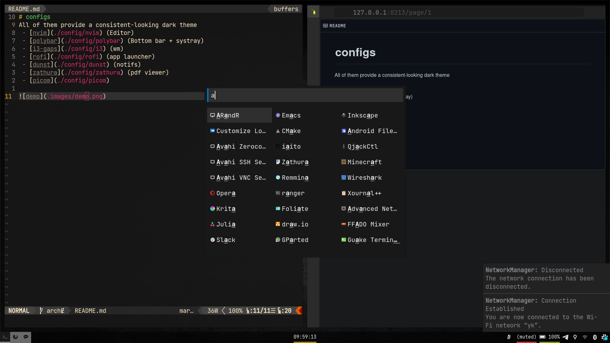

# configs
 - [nvim](./config/nvim) (Editor)
 - [polybar](./config/polybar) (Bottom bar + systray)
 - [i3-gaps](./config/i3) (wm)
 - [rofi](./config/rofi) (app launcher)
 - [dunst](./config/dunst) (notifs)
 - [zathura](./config/zathura) (pdf viewer)
 - [picom](./config/picom)

All of them provide a consistent-looking dark theme

# firefoxcss
hugely derived from [here](https://www.reddit.com/r/FirefoxCSS/comments/gvgtxs/minimal_dark_css/)

features (better if you go through that reddit post first):
 - vertical tab sidebar
 - some urlbar modifications from [here](https://github.com/datguypiko/Firefox-Mod-Blur)
 - you have to try it to see how awesome it is
