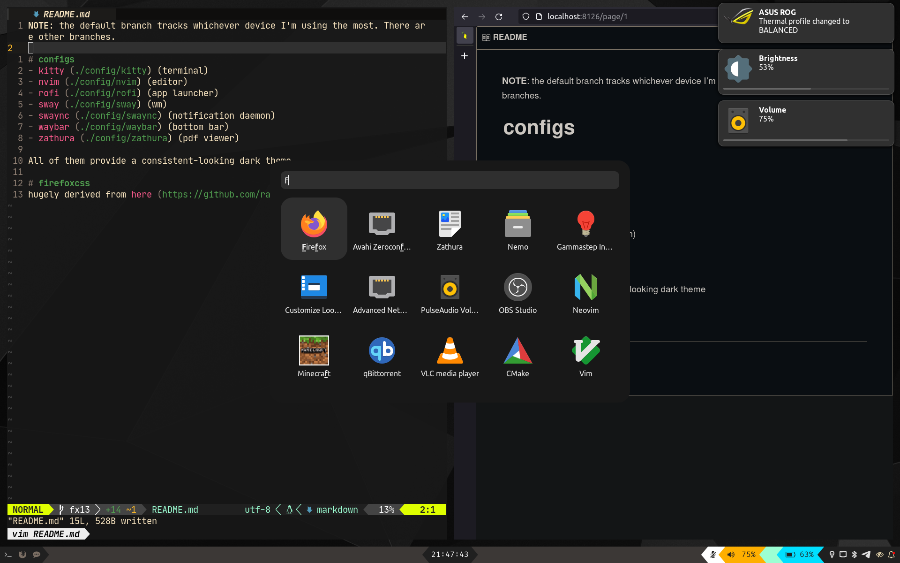

**NOTE**: the default branch tracks whichever device I'm using the most. There are other branches.

# configs
- [kitty](./config/kitty) (terminal)
- [nvim](./config/nvim) (editor)
- [rofi](./config/rofi) (app launcher)
- [sway](./config/sway) (wm)
- [swaync](./config/swaync) (notification daemon)
- [waybar](./config/waybar) (bottom bar)
- [zathura](./config/zathura) (pdf viewer)

All of them provide a consistent-looking dark theme

# firefoxcss
hugely derived from [here](https://github.com/ranmaru22/firefox-vertical-tabs)
